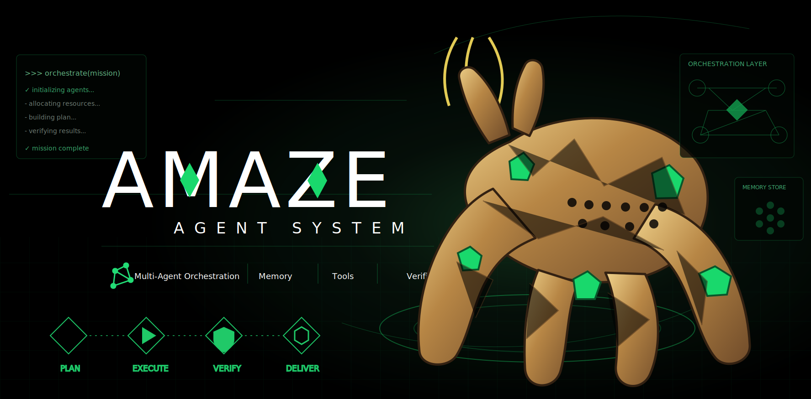

<div align="center">



# amaze

**A unified AI coding agent — orchestration, code intelligence, durable memory, tools, and verification in one terminal.**

</div>

---

amaze is the main repository for the local agent system. It works with two companion repositories:

| Product | Repository | Role |
|---|---|---|
| **amaze** | <https://github.com/steve-8000/amaze> | CLI agent. Provides file, shell, code, language-server, subagent, sandbox, channel, and verification tools. |
| **Xenonite** | <https://github.com/steve-8000/xenonite> | Always-on Docker/API project intelligence core. Owns durable memory, semantic code search, code graphs, realtime watchers, and context bundles. |
| **rocky** | <https://github.com/steve-8000/rocky> | OpenAI-compatible local model server for chat and embeddings. |

```
amaze (CLI) ──HTTP API──▶ Xenonite Docker server (memory + code intelligence) ──HTTP──▶ rocky (LLM + embeddings)
```

## Runtime workflow

The intended end-to-end flow is:

1. **Goal / user turn** — `/goal`, `create_goal`, or an ordinary user request enters the amaze CLI. Active goals are resumed by hidden continuation prompts that require a completion audit before `update_goal(status="complete")`.
2. **Orchestrator** — multi-step `agent_run` work defaults to profiled orchestration. The orchestrator classifies the request, compiles an execution policy, and emits `harness_run_contract` FreshBoot child contracts.
3. **FreshBoot child execution** — child agents boot fresh with parent conversation, parent system prompt, parent tools, and project context inheritance disabled. Child-local core tools, skills, and Xenonite remain available through the child's own runtime.
4. **Path contracts and memory** — workers operate inside explicit read/write path boundaries. Path memory attachments use stable path ids and Xenonite namespaces; memory updates are read-only during execution and committed only after validation.
5. **Xenonite intelligence** — `index_*`, `search_query`, `graph_*`, `ctx_*`, `mem_*`, and `mem_optimize` call Xenonite's HTTP API directly from amaze core tools.
6. **rocky model services** — Xenonite uses rocky's OpenAI-compatible LLM endpoint for memory optimization/classification and rocky's embedding endpoint for vector search.
7. **Verification** — validators and the parent agent must verify changed files, tests, and user-visible behavior before reporting completion.

## Features

- **Multi-agent orchestration** — delegate bounded work to planner, reviewer, worker, researcher, scout, context-builder, oracle, and delegate agents.
- **Code intelligence** — AST-aware structural search/rewrite, language-server diagnostics, jump-to-definition, and safe renames.
- **Semantic search + graph** — index a codebase and search it by meaning; explore symbols, dependencies, and impact across files.
- **Durable memory** — recall and store verified project facts and decisions through Xenonite.
- **Scoped memory isolation** — global memory is for operator preferences/style only; project/repo facts and folder/path facts live in separate Xenonite scopes.
- **Memory optimizer** — `mem_optimize` / `/v1/memory/optimize` dry-runs or applies sequential LLM-assisted dedupe, cleanup, and scope reclassification.
- **Sandboxed execution** — run commands inside isolated local sandboxes.
- **Xenonite API backend** — `index_*`, `search_query`, `graph_*`, `ctx_*`, `mem_*`, and `mem_optimize` are default amaze tools backed by Xenonite's always-on HTTP API.
- **Single amaze config** — local feature toggles live in `amaze.toml`; model and subagent routing live in `~/.amaze/agent`.

## Exact local-system install guide

Use this section when handing setup to another agent. The commands reproduce the current Steve local system as closely as the public repositories allow, including exact model names, ports, and config files.

### 0. Requirements

- macOS 13+ on Apple Silicon for rocky MLX inference.
- Node.js `>=24.0.0`.
- npm and pnpm.
- Python `>=3.10`.
- `uv` for rocky.
- Git.

### 1. Clone the three repositories

```bash
mkdir -p ~/rocky
mkdir -p ~/llm

cd ~/llm
git clone https://github.com/steve-8000/rocky

cd ~/rocky
git clone https://github.com/steve-8000/xenonite
git clone https://github.com/steve-8000/amaze
```

Expected layout:

```text
~/llm/rocky
~/rocky/xenonite
~/rocky/amaze
```

### 2. Install and start rocky

rocky provides the OpenAI-compatible local endpoints used by both amaze and Xenonite.
rocky is a companion service, not vendored into this repository; if it is already running from another checkout or service manager, verify the endpoints below instead of starting a second instance.

```bash
cd ~/llm/rocky
uv sync

# Terminal 1: LLM server, http://127.0.0.1:7777/v1
make serve

# Terminal 2: embedding server, http://127.0.0.1:7778/v1
make embed
```

Exact current LLM model string:

```text
mlx-community/gemma-4-12B-it-qat-4bit
```

rocky preset for that model:

```text
gemma4-12b
```

Embedding endpoint/model as consumed by Xenonite:

```text
base URL: http://127.0.0.1:7778/v1
model:    default
```

Health checks:

```bash
curl -s http://127.0.0.1:7777/health
curl -s http://127.0.0.1:7778/health
```

Runtime smoke checks used by the workflow are `/v1/chat/completions` on port `7777` and `/v1/embeddings` on port `7778`.

### 3. Install Xenonite

```bash
cd ~/rocky/xenonite
npm install
```

Create the Xenonite config. If this file is absent, Xenonite uses these same defaults; writing it makes the target setup explicit.

```bash
mkdir -p ~/.config/xenonite
cat > ~/.config/xenonite/xenonite.toml <<'EOF'
port = 8700
data_dir = "${HOME}/.local/share/xenonite"

llm_url = "http://127.0.0.1:7777/v1"
llm_model = "mlx-community/gemma-4-12B-it-qat-4bit"
llm_key = "x"

embed_url = "http://127.0.0.1:7778/v1"
embed_model = "default"
embed_key = "x"
EOF
```

Start the Docker API service:

```bash
cd ~/rocky/xenonite
docker compose up -d
```

Xenonite health check:

```bash
curl -s http://127.0.0.1:8700/health
curl -s http://127.0.0.1:8700/v1/config
```

### 4. Install amaze

```bash
cd ~/rocky/amaze
pnpm install
pnpm build:pnpm

cd packages/coding-agent
npm link
```

Confirm the CLI is available:

```bash
amaze --help
```

### 5. Configure amaze feature toggles

Create `~/.config/amaze/amaze.toml`:

```bash
mkdir -p ~/.config/amaze
cat > ~/.config/amaze/amaze.toml <<'EOF'
# amaze global config — all features wired to Xenonite + rocky
[tools.file]
enabled = true
[tools.shell]
enabled = true
[tools.web]
enabled = true
[tools.code]
enabled = true
[tools.lang]
enabled = true
[tools.search]
enabled = true
[tools.mem]
enabled = true

[agents]
enabled = true
[hooks]
enabled = true
[desk]
enabled = false
[sandbox]
enabled = true
provider = "local"

[skills]
enabled = true
auto_improve = false

[session.compression]
enabled = true
engine = "senpi"

[services.xenonite]
enabled = true
url = "http://127.0.0.1:8700"
port = 8700
host_prefix = "/host"
auto_index = true
auto_watch = true
require = false
EOF
```

amaze resolves config in this order:

```text
$AMAZE_CONFIG → ./amaze.toml → ~/.config/amaze/amaze.toml → ~/.amaze/amaze.toml
```

### 6. Configure the local OpenAI-compatible model provider

Create `~/.amaze/agent/models.json`:

```bash
mkdir -p ~/.amaze/agent
cat > ~/.amaze/agent/models.json <<'EOF'
{
  "providers": {
    "local": {
      "baseUrl": "http://127.0.0.1:7777/v1",
      "api": "openai-completions",
      "apiKey": "x",
      "compat": {
        "supportsDeveloperRole": false,
        "supportsReasoningEffort": false
      },
      "models": [
        {
          "id": "mlx-community/gemma-4-12B-it-qat-4bit",
          "name": "gemma4-12b",
          "contextWindow": 65536
        }
      ]
    }
  }
}
EOF
```

### 7. Configure exact current subagent model routing

Create `~/.amaze/agent/settings.json`:

```bash
cat > ~/.amaze/agent/settings.json <<'EOF'
{
  "permission": {
    "*": "allow"
  },
  "subagents": {
    "agentOverrides": {
      "oracle": {
        "model": "gpt-5.5",
        "thinking": "high",
        "tools": [
          "read",
          "grep",
          "find",
          "ls",
          "bash",
          "intercom",
          "index_status",
          "graph_status",
          "search_query",
          "graph_query",
          "graph_stats",
          "graph_cycles",
          "graph_impact",
          "graph_trace",
          "graph_symbol",
          "graph_symbols",
          "mem_recall",
          "mem_search"
        ]
      },
      "planner": {
        "model": "gpt-5.5",
        "thinking": "high",
        "tools": [
          "read",
          "grep",
          "find",
          "ls",
          "write",
          "intercom",
          "index_status",
          "graph_status",
          "search_query",
          "graph_query",
          "graph_stats",
          "graph_cycles",
          "graph_impact",
          "graph_trace",
          "graph_symbol",
          "graph_symbols",
          "mem_recall",
          "mem_search"
        ]
      },
      "context-builder": {
        "model": "gpt-5.4-mini",
        "thinking": "medium",
        "tools": [
          "read",
          "grep",
          "find",
          "ls",
          "bash",
          "write",
          "web_search",
          "intercom",
          "index_status",
          "graph_status",
          "search_query",
          "graph_query",
          "graph_stats",
          "graph_cycles",
          "graph_impact",
          "graph_trace",
          "graph_symbol",
          "graph_symbols",
          "ctx_search",
          "mem_recall",
          "mem_search"
        ]
      },
      "worker": {
        "model": "gpt-5.5",
        "thinking": "high",
        "tools": [
          "read",
          "grep",
          "find",
          "ls",
          "bash",
          "edit",
          "write",
          "contact_supervisor",
          "index_status",
          "graph_status",
          "search_query",
          "graph_query",
          "graph_stats",
          "graph_cycles",
          "graph_impact",
          "graph_trace",
          "graph_symbol",
          "graph_symbols",
          "mem_recall",
          "mem_search"
        ]
      },
      "researcher": {
        "model": "gpt-5.3-codex-spark",
        "thinking": "medium"
      },
      "scout": {
        "model": "gpt-5.4-mini",
        "thinking": "low",
        "tools": [
          "read",
          "grep",
          "find",
          "ls",
          "bash",
          "write",
          "intercom",
          "index_status",
          "graph_status",
          "search_query",
          "graph_query",
          "graph_stats",
          "graph_cycles",
          "graph_impact",
          "graph_trace",
          "graph_symbol",
          "graph_symbols",
          "mem_recall",
          "mem_search"
        ]
      },
      "delegate": {
        "model": "gpt-5.5",
        "thinking": "medium"
      },
      "reviewer": {
        "model": "gpt-5.5",
        "thinking": "high",
        "tools": [
          "read",
          "grep",
          "find",
          "ls",
          "bash",
          "edit",
          "write",
          "intercom",
          "index_status",
          "graph_status",
          "search_query",
          "graph_query",
          "graph_stats",
          "graph_cycles",
          "graph_impact",
          "graph_trace",
          "graph_symbol",
          "graph_symbols",
          "mem_recall",
          "mem_search"
        ]
      }
    }
  },
  "defaultProvider": "openai-codex",
  "defaultModel": "gpt-5.5",
  "defaultThinkingLevel": "medium"
}
EOF
```

Exact current role model strings:

| Role | Model | Thinking |
|---|---|---|
| default | `gpt-5.5` | `medium` |
| oracle | `gpt-5.5` | `high` |
| planner | `gpt-5.5` | `high` |
| context-builder | `gpt-5.4-mini` | `medium` |
| worker | `gpt-5.5` | `high` |
| researcher | `gpt-5.3-codex-spark` | `medium` |
| scout | `gpt-5.4-mini` | `low` |
| delegate | `gpt-5.5` | `medium` |
| reviewer | `gpt-5.5` | `high` |

### 8. Run amaze

With rocky and Xenonite already running:

```bash
cd ~/rocky/amaze
amaze
```

Useful first checks inside amaze:

```text
Use index_status to confirm Xenonite indexing is reachable.
Use mem_recall with a harmless query to confirm durable memory is reachable.
Use mem_optimize with dryRun=true, useLlm=false to confirm the memory optimizer endpoint is reachable without rewriting data.
Use agent_run list to confirm subagents are loaded.
```

## Xenonite API backend

amaze's built-in memory/search tools use the always-on Xenonite HTTP API directly. Users do not define these tools in `AGENTS.md`; they are registered by builtin extensions the same way `read` is registered by the runtime.

```bash
cd ~/rocky/xenonite
docker compose up -d
```

Useful checks:

```bash
curl -s http://127.0.0.1:8700/health
curl -s http://127.0.0.1:8700/v1/config
```

### Memory scope rules

Durable memory is intentionally split by scope:

| Scope | Use for | Storage intent |
|---|---|---|
| `global` / `common` / `operator` | Steve/operator preferences, reporting style, stable personal workflow preferences | Shared across projects |
| `project` / `repo` | Repo-wide verified facts, architectural decisions, persistent project constraints | Isolated per project path |
| `path` / `folder` | Folder/work-package decisions, known failures, contract summaries | Isolated per path namespace |

Operational rules:

- `mem_recall` and `mem_search` default to project scope from the current working directory.
- Passing `path` or `pathId` selects path/folder scope.
- `mem_store` only keeps `scope: "global"` when `source: "direct_user_request"`; verified project facts are forced back to project scope.
- FreshBoot path memory uses stable path ids and Xenonite namespaces, and child memory updates are committed only after validation.

### Memory optimizer

Run a dry-run before applying memory cleanup:

```text
mem_optimize({ "dryRun": true, "maxFacts": 200, "batchSize": 8, "useLlm": true })
```

Apply only after reviewing the dry-run result:

```text
mem_optimize({ "apply": true, "maxFacts": 200, "batchSize": 8, "useLlm": true })
```

The optimizer processes batches sequentially through Xenonite's configured rocky LLM, deduplicates facts by topic, removes transient/test artifacts, and reclassifies facts into global/project/path scopes.

## Troubleshooting

- If `mem_recall` says Xenonite is unreachable, start Xenonite:
  ```bash
  cd ~/rocky/xenonite
  docker compose up -d
  ```
- If model calls fail, confirm rocky is listening:
  ```bash
  curl -s http://127.0.0.1:7777/health
  curl -s http://127.0.0.1:7778/health
  ```
- If `amaze` is not found, relink the CLI:
  ```bash
  cd ~/rocky/amaze/packages/coding-agent
  npm link
  ```
- If another local config overrides these values, run with:
  ```bash
  AMAZE_CONFIG=~/.config/amaze/amaze.toml amaze
  ```

## Status

amaze is under active development. Interfaces may change.
