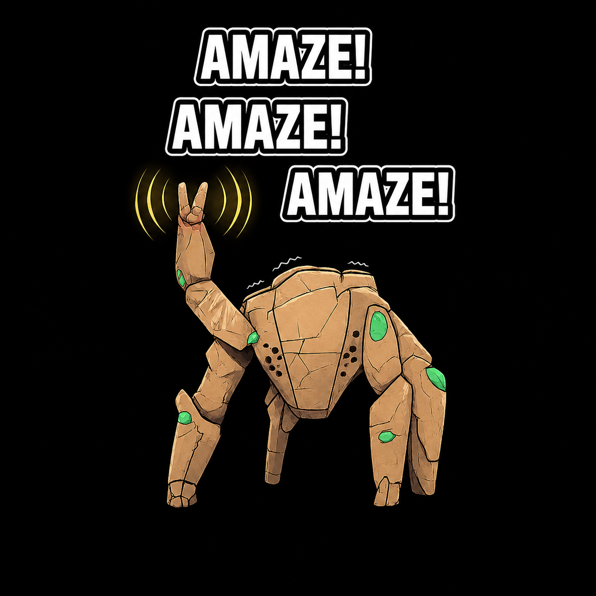

# Amaze

**A compact coding-agent runtime for engineers who want the agent to do the work, not narrate the struggle.**

Amaze is configured here as a source-controlled daily driver: Codex writes code, Opus plans and reviews, Grok researches X/Twitter, and a small subagent roster handles bounded parallel work without turning every task into a prompt tax.

Built for:

- fast repository understanding
- tool-grounded code changes
- concise user-facing output
- reproducible project skills and settings
- high-context workers under a low-token orchestrator

## Model routing

| Use | Model |
| --- | --- |
| Default coding | `openai-codex/gpt-5.5` |
| Planning | `anthropic/claude-opus-4-7` |
| Review | `anthropic/claude-opus-4-7` |
| X/Twitter research | `xai/grok-4.3` |

## Subagents

Active bundled subagents:

| Agent | Purpose |
| --- | --- |
| `quick_task` | small mechanical work |
| `task` | normal delegated implementation |
| `explore` | read-only codebase scouting |
| `plan` | architecture and sequencing |
| `reviewer` | final review |
| `oracle` | hard debugging / second opinion |
| `researcher` | xAI X/Twitter research |
| `visual_qa` | browser and UI validation |

## Prompt cache and memory flow

The runtime separates a long-lived parent from short-lived workers.

1. Session role is detected at creation:
   - `taskDepth > 0` or `parentTaskPrefix` → subagent
   - otherwise → top-level orchestrator
2. The orchestrator stays compact:
   - `prompt.mainContextMode = compact`
   - only the nearest context file is placed in the system prompt
   - large static context such as workspace tree and skill listing is excluded
   - `task.eager = true` encourages non-trivial work to be delegated instead of making the parent read and edit everything itself
   - prompt cache retention uses provider/global default; current AI-layer default is long retention
3. Subagents get full execution context:
   - project context mode is full
   - root/nearest context, workspace tree, and skill listing are included
   - `task.eager = false` prevents recursive delegation drift
   - cache retention is short to avoid long-cache write premium for one-shot workers
4. Provider calls receive the resolved policy:
   - project context mode feeds system prompt construction
   - cache retention is passed through the Agent into provider request options
   - `undefined` means provider/global default

The intended shape is: parent = low-token, long-lived orchestrator; subagents = short-lived, high-context executors. The parent keeps goals, todos, and integration state; workers do detailed file work and yield concise results.

Reasoning summaries are hidden by default (`hideThinkingBlock = true`). User-facing output should be decisions, evidence, risks, and results — not raw deliberation logs.


## Strengths

- Small agent roster: less prompt overhead and less routing ambiguity.
- Strong default model split: Codex for coding, Opus for planning/review, Grok for X research.
- Reproducible project profile: `.amaze/settings.json` and `.amaze/skills/` are source-controlled.
- Tool-first workflow: file reads, search, LSP, debugging, browser validation, and subagent delegation stay available.
- Safer local setup: runtime state and credentials stay out of git.

## Tradeoffs

- Fewer specialist agents. UI work uses `task` + `visual_qa`; library research uses normal tools and source reads.
- Requires configured credentials for OpenAI Codex, Anthropic, and xAI to use the default routing fully.
- Subagents still cost tokens. Use them for parallelism, review, or isolation, not by habit.

## Project profile

Runtime configuration lives in:

```text
.amaze/settings.json
.amaze/skills/
```

Local-only state is intentionally ignored:

```text
agent.db*
.env
logs
sessions
build outputs
```

## Local install

```sh
bun install
bun --cwd=packages/coding-agent run build
cp packages/coding-agent/dist/amaze ~/.bun/bin/amaze
```

Then start a new session:

```sh
amaze
```

## Verify

```sh
bun check
```
